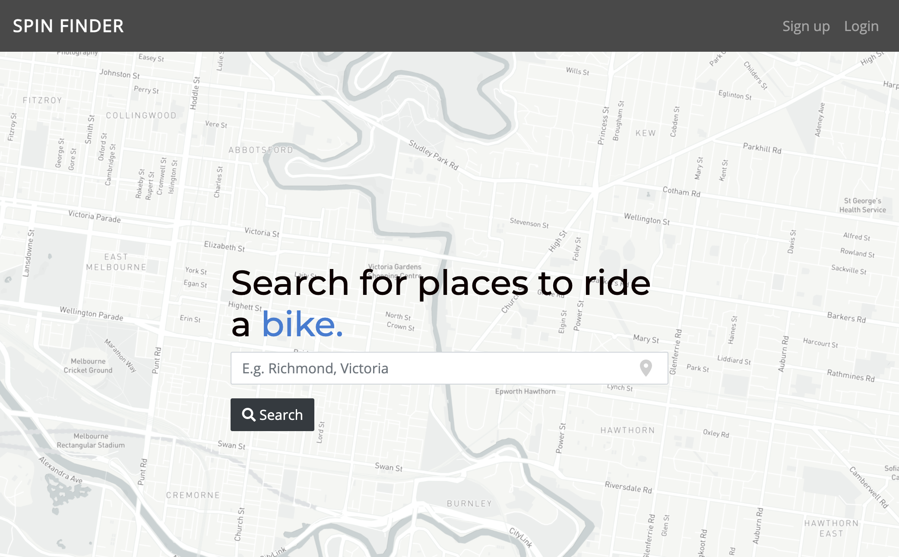
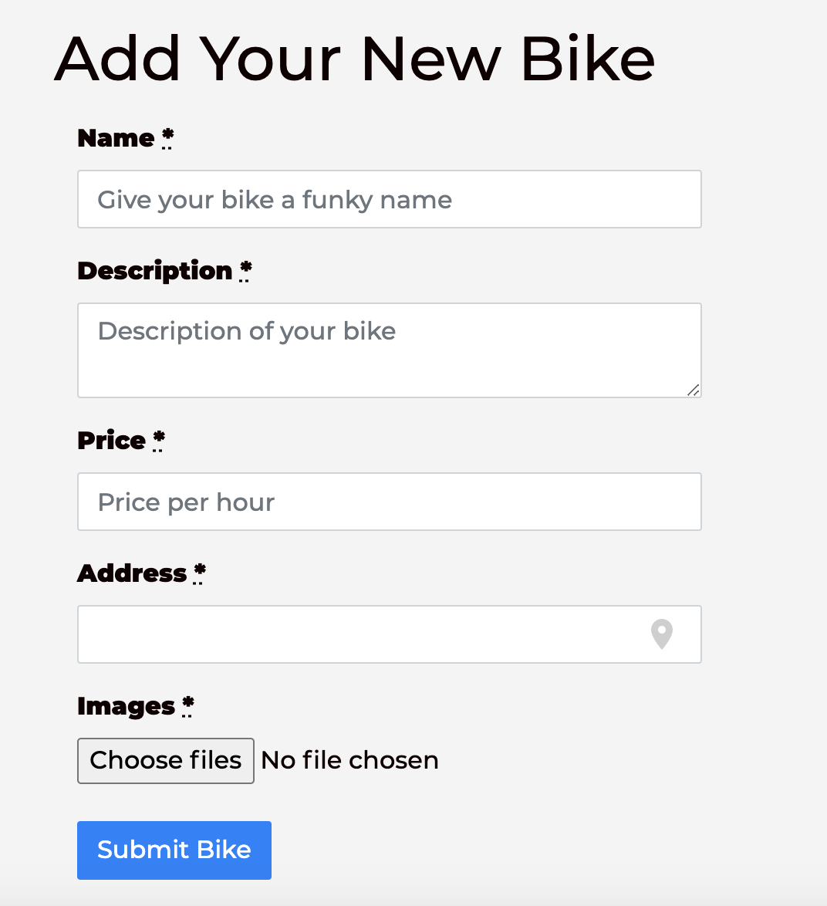
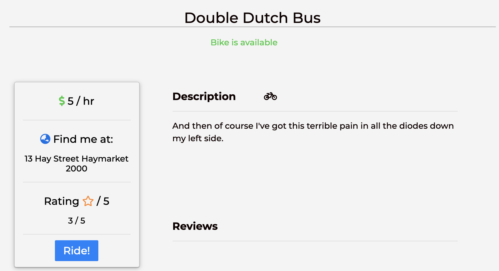
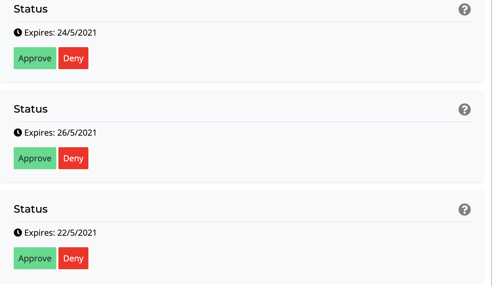
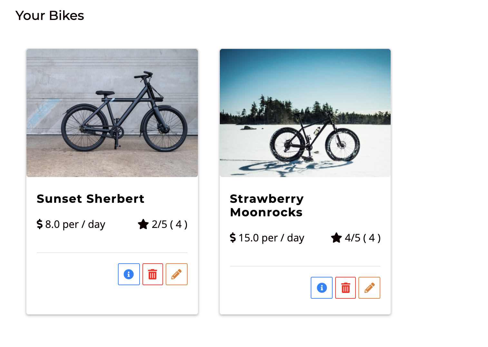
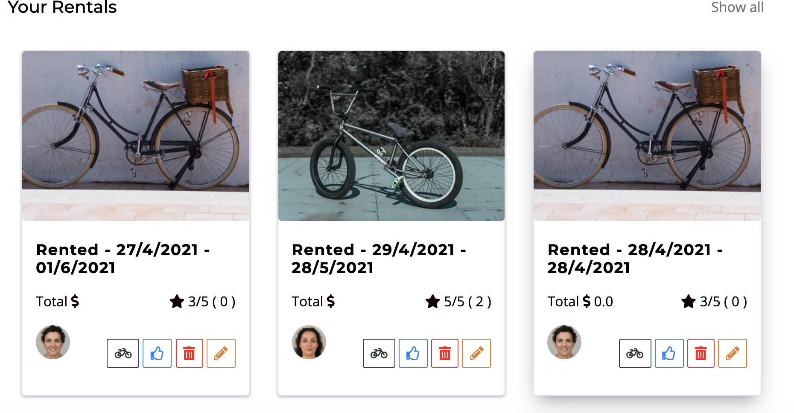

Team Project from Le Wagon Batch #466 Feb 2021 ( Melbourne )

View @ =>
https://spin-finder.herokuapp.com/

Test Account => 
user: spin@gmail.com
pass: 123456

Rails app generated with [lewagon/rails-templates](https://github.com/lewagon/rails-templates), created by the [Le Wagon coding bootcamp](https://www.lewagon.com) team :) 

# Spin Finder

## About

Spin Finder - Upload and rent bicycles in your local area. A marketplace for every keen cyclist.



This application was built with
```
Ruby on Rails, Javascript, HTML & CSS.
```

## Live site:

[Spin Finder](https://spin-finder.herokuapp.com/)

## Setup

If you would like to look at the code then clone the GitHub repository and change directory into `spin_finder`:
```
gh repo clone matoni109/spin_finder
```

You will also need Bundler installed:
```
bundle install
```
This will install the gems needed to run the program correctly.

## Navigating the application

You can create a new account with your email address and a password or alternatively you can log in our admin account with:

```
user: spin@gmail.com
pass: 123456

```

Add a bike to rent out to other users..



Check out bikes..



Add reviews and view others..


Feel free to go to your account page when you can see your bikes for rent - the bikes you have rented and also approve and deny bookings!






## Technologies used

- AJAX
- Postgres DB & seeding
- Bootstrap
- Mapbox/Geocoder
- Pundit
- HTML, CSS, Javascript, Ruby on Rails

### Made with ❤️ by Julian, Chris & Tom
